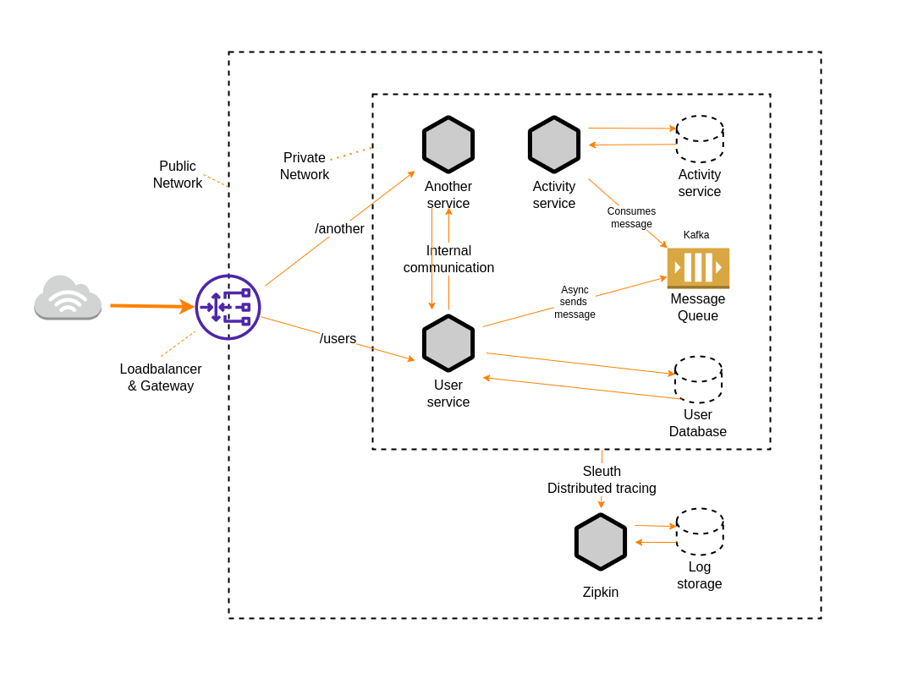

# OMLab project

Fork me on Github: https://github.com/hung-vi/microservices-omlab

## Overview

This is a simple implementation of miroservices architecture using Docker and Spring Boot framework

<p align="center">
  
</p>

 * Docker
   * Builds and runs applications in isolated environments
 * API Gaetway
   * The main entry point
   * Uses Spring Cloud Gateway for rapid development. In production environment we can choose another API gateway technology, such as Kong for higher throughput and security.
 * Services
   * Uses Spring Boot framework to create micro services
 * DBMS
   * Uses PostgreSQL as a solution for Object-Relational Database System
 * Message queue
   * Uses Apache Kafka & Zookeeper as a solution for scalable Distributed Event Streaming
 * Log tracing
   * Uses Spring Sleuth and Zipkin as a solution for Distributed tracing
 * Features should be implemented for `PRODUCTION` environment
   * Continuous Integration (CI)
     * Uses Jenkin or CircleCI or and other platform(s) for building applications
     * Auto-generate Dockerfile
   * Kubernetes
     * Automates container management and deploying applications
   * Services:
     * Health-check
     * Graceful shutdown
     * Manages environment configuration
     * Interconnects API gateway and Auth-Service for authentication
     * Implements authorization
   * Distributed transaction
   * DBMS
   * Storage
   * Many things left to do to build a large scale platform :)


## Docker Compose YAML

**docker-compose.yml**

 * YAML file for deploying required services for local development evironment
 * Do not use this for production evironment
 * Services to start
     * zipkin
     * postgresql
     * zookeeper
     * kafka
     * apigw
     * user-service
     * activity-service

## Usage

Preparation for development environment

 * Remove all outdated data
  * Ignore these commands if you are sure that they are not necessary
```
docker stop $(docker ps -aq)
docker rm $(docker ps -aq)
docker network prune
```

 * Start PostgreSQL and initialize users and dabatbases
```
$ docker-compose up -d postgresql
```

 * Start Zipkin for distributed tracing
```
$ docker-compose up -d zipkin
```

 * Start Kafka & Zookeeper for message queue component
```
$ docker-compose up -d kafka
```

 * Build services
```
$ ./gradlew build
```

 * Create and start all services
```
$ docker-compose up -d
```

* Stop all services
```
$ docker-compose down
```

 * Stop a single service
```
$ docker-compose up user-service -d
```

## Communicate with the system via public APIs

Refer to `./scripts/test/user.http` for more details
